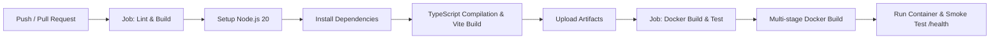

# UMLForge — Interactive UML Class Diagram & Java Source Generator

[](https://react.dev/)
[](https://www.typescriptlang.org/)
[](https://vitejs.dev/)
[](https://tailwindcss.com/)
[](https://reactflow.dev/)
[](https://www.docker.com/)
[](https://github.com/features/actions)

> **Web Technology (WT) — Assignment 7**  
> Developed by **Varad** ([@KVarad777](https://github.com/KVarad777))  
> A developer-grade visual workspace for interactively creating and designing UML Class Diagrams with real-time, synchronized Java 17/21 source code generation.

---

## 1. Project Overview

**UMLForge** bridges visual software architecture design and practical object-oriented programming. It allows software architects, engineers, and students to visually map out class hierarchies, relationships, attributes, and operations on an interactive canvas while simultaneously generating clean, formatted, and compilable Java source code.

Instead of writing repetitive boilerplate code or maintaining static diagram mockups, **UMLForge** provides a live two-way synchronization model: any change on the diagram immediately translates into idiomatic Java declarations, fields, constructors, getters/setters, collection initializations, and method stubs.

---

## 2. Architecture & Mental Model

```text
┌────────────────────────────────────────────────────────────────────────────────────────┐
│                                       UMLForge                                         │
│                  [ Presets ]  [ New ]  [ Import ]  [ Export ▾ ]  [ ☀️/🌙 ]             │
├──────────────────────────────────────────┬─────────────────────────────────────────────┤
│                                          │                                             │
│        INTERACTIVE UML CANVAS            │        LIVE JAVA SOURCE VIEWER              │
│                                          │                                             │
│    ┌───────────────────────────┐         │   Order.java                                │
│    │          Order            │         │                                             │
│    ├───────────────────────────┤         │   package com.store.order;                  │
│    │ - orderNumber : String    │         │                                             │
│    │ - totalAmount : BigDecimal│─────────┼─► public class Order {                      │
│    │ - tags : String[]         │         │       private String orderNumber;           │
│    ├───────────────────────────┤         │       private BigDecimal totalAmount;       │
│    │ + calculateTotal() : void │         │       private String[] tags;                │
│    └─────────────┬─────────────┘         │       private List<OrderItem> itemsList;    │
│                  │ (contains 1..*)       │                                             │
│                  ▼                       │       public Order() {}                     │
│    ┌───────────────────────────┐         │       // Getters, Setters, & Methods...     │
│    │        OrderItem          │         │   }                                         │
│    └───────────────────────────┘         │                                             │
│                                          │   [ Copy Code ]  [ Download Project (.zip) ]│
└──────────────────────────────────────────┴─────────────────────────────────────────────┘
```

---

## 3. Key Features

### 📐 1. Movable & Interactive UML Canvas (`@xyflow/react`)
- **Interactive Drag & Pan**: Drag classes freely across an infinite workspace with zoom, pan, and mini-map affordances.
- **Dagre Hierarchical Auto-Layout**: One-click automatic graph alignment for clean, organized software architectural diagrams.
- **Multi-Directional Ports**: Connect classes seamlessly from any of the 4 card ports (Top, Right, Bottom, Left).
- **Background Styles**: Switch between subtle Dot Grid, Cross Grid, and Lines.

### 🏷️ 2. Comprehensive UML Stereotypes & Visibility
- **Stereotypes Supported**:
  - `class`: Standard concrete Java class
  - `«interface»`: Interface contract with default/static method support
  - `«abstract»`: Abstract class with abstract and concrete operations
  - `«enum»`: Enumeration with constants management
  - `«record»`: Java 14+ Record structure
- **Standard UML Visibility Notation**:
  - `+` : `public`
  - `−` : `private`
  - `#` : `protected`
  - `~` : `package-private` / default

### 🔗 3. Standard UML Relationships & Semantic Java Mapping
| UML Relationship | Visual Notation | Java Code Translation |
| :--- | :--- | :--- |
| **Inheritance** | Solid line + Hollow Triangle | `public class Child extends Parent` |
| **Realization** | Dashed line + Hollow Triangle | `public class Implementation implements Interface` |
| **Composition** | Solid line + Filled Diamond | Inferred child field / collection (`List<Item>`) initialized and managed |
| **Aggregation** | Solid line + Hollow Diamond | Inferred reference / collection (`List<Item>`) passed via dependency |
| **Association** | Solid line + Open Arrow | Direct member reference to target type |
| **Dependency** | Dashed line + Open Arrow | Transient method parameter or return usage |

- **Multiplicity Labels**: Editable cardinalities (`1`, `0..1`, `1..*`, `*`) on source and target edges.

### ⚡ 4. Right-Click Context Menu
- Right-clicking any class node opens a floating action menu:
  - ✏️ **Edit Properties**: Focuses the contextual property inspector.
  - ➕ **Add Attribute**: Quick-adds a field directly to the class.
  - ➕ **Add Method**: Quick-adds an operation signature.
  - 📄 **Duplicate Class**: Clones the complete structure.
  - 🔄 **Change Kind**: Switch instantly between Class, Interface, Abstract, Enum, and Record.
  - 🗑️ **Delete Class**: Removes class and connected relationships.

### 📦 5. Rich Data Types & Array Support
- **Primitives**: `int`, `long`, `double`, `float`, `boolean`, `char`, `byte`, `short`, `void`.
- **Java Arrays**: `String[]`, `int[]`, `long[]`, `double[]`, `byte[]`, `boolean[]`, `Object[]`, and custom class arrays (`ClassName[]`).
- **Standard Objects**: `String`, `UUID`, `LocalDate`, `LocalDateTime`, `BigDecimal`, `BigInteger`, `Optional<T>`.
- **Collections**: `List<T>`, `Set<T>`, `Map<K,V>`, `Queue<T>`, `Deque<T>`.
- **Custom Diagram Classes**: Existing classes in your diagram automatically populate type auto-suggestions!

### ☕ 6. Live Synchronized Java 17/21 Code Engine
- **Automatic Imports**: Auto-detects and includes `java.util.*`, `java.time.*`, `java.math.*`.
- **Full Bean Generation**: Default constructors, parameterized constructors, getters, setters, and `toString()` overrides.
- **Array Return Stubs**: Automatically stubs array methods (e.g., `return new String[0];`).
- **One-Click Copy & Export**: Instant code copying with particle feedback, single `.java` file download, and full Maven/Gradle `.zip` export.

### 🎨 7. Dual-Theme Engine (Dark Slate & Clean Light Mode)
- **Dark Theme**: Deep developer slate (`#080c14`, `#0d131f`) with high-contrast neon accents.
- **Light Theme**: Clean, crisp studio palette (`#f8fafc`, `#ffffff`) with matching light canvas background and high-legibility syntax colors.

---

## 4. Technology Stack

| Layer | Technology | Description |
| :--- | :--- | :--- |
| **UI Library** | React 19 (`19.2.8`) | Modern component architecture and hooks |
| **Language** | TypeScript 6.0 | Strict type safety across diagram models and Java AST |
| **Bundler** | Vite 8.2 | Lightning-fast HMR and production tree-shaking |
| **Styling** | Tailwind CSS v4 (`@tailwindcss/vite`) | Utility-first CSS with custom CSS theme variables |
| **Diagram Engine** | `@xyflow/react` (React Flow v12) | Node canvas, custom edge paths, handles, and viewport controls |
| **Graph Layout** | `dagre` (`@types/dagre`) | Hierarchical directed graph layout computation |
| **Icons & Effects** | `lucide-react`, `canvas-confetti` | Minimalist icons and interaction micro-animations |
| **File Archiving** | `jszip`, `file-saver` | Client-side ZIP generation and diagram persistence |
| **Containerization** | Docker, Nginx Alpine, Docker Compose | Production multi-stage image and containerized server |
| **CI/CD** | GitHub Actions | Automated lint, build, test, and container verification |

---

## 5. Project Directory Structure

```text
Assignment 7/
├── .github/
│   └── workflows/
│       └── ci.yml                     # Self-contained GitHub Actions workflow
├── public/
│   └── favicon.svg                    # UMLForge SVG application icon
├── src/
│   ├── components/
│   │   ├── canvas/
│   │   │   ├── CanvasToolbar.tsx      # Floating canvas actions (+ Class, Auto Layout, ⋯)
│   │   │   ├── ContextMenu.tsx        # Right-click floating action menu on nodes
│   │   │   ├── UMLCanvas.tsx          # React Flow canvas wrapper with theme grid
│   │   │   ├── UMLClassNode.tsx       # Custom UML class node renderer
│   │   │   └── UMLEdge.tsx            # Custom UML relationship connector with markers
│   │   ├── codegen/
│   │   │   └── JavaViewerPanel.tsx    # Live Java code editor, line numbers, and copy
│   │   ├── inspector/
│   │   │   ├── AttributeEditor.tsx    # Compact field editor with type datalists
│   │   │   ├── InspectorPanel.tsx     # Contextual slide-over property editor
│   │   │   ├── MethodEditor.tsx       # Operation editor with parameter lists
│   │   │   └── RelationshipEditor.tsx # Relationship type & multiplicity editor
│   │   └── layout/
│   │       └── AppHeader.tsx          # Top navbar (Presets, Export, Theme, Layout focus)
│   ├── core/
│   │   ├── diagramUtils.ts            # Dagre auto-layout, JSON import/export, ZIP builder
│   │   ├── initialData.ts             # Realistic presets (E-Commerce, Observer Pattern)
│   │   ├── javaGenerator.ts           # Core AST to Java source translation engine
│   │   └── types.ts                   # TypeScript data models and type constants
│   ├── App.tsx                        # Master state orchestrator and layout manager
│   ├── index.css                      # Dual-theme variables and React Flow styling
│   └── main.tsx                       # React application entry point
├── .dockerignore                      # Docker context exclusions
├── docker-compose.yml                 # Docker Compose local deployment configuration
├── Dockerfile                         # Multi-stage production Docker build
├── index.html                         # HTML5 shell with Google Fonts (Inter, JetBrains Mono)
├── nginx.conf                         # Production Nginx reverse proxy & SPA router
├── package.json                       # NPM dependencies and build scripts
├── tsconfig.app.json                  # TypeScript compiler settings
├── tsconfig.json                      # Workspace TS configuration
└── vite.config.ts                     # Vite + Tailwind v4 configuration
```

---

## 6. Getting Started Locally

### Prerequisites
- **Node.js**: Version 20.0 or higher
- **npm**: Version 10.0 or higher

### Installation & Run

1. Navigate to the project directory:
   ```bash
   cd "Assignment 7"
   ```

2. Install all dependencies:
   ```bash
   npm install
   ```

3. Launch the development server:
   ```bash
   npm run dev
   ```

4. Open your browser and navigate to:
   ```text
   http://localhost:5173
   ```

### Production Build & Preview

```bash
# Compile TypeScript and generate optimized bundle
npm run build

# Preview production build locally
npm run preview
```

---

## 7. Docker & Container Deployment

### 1. Build and Run Container with Docker

```bash
# 1. Build the production Docker image
docker build -t umlforge-app .

# 2. Run the container on port 8080
docker run -d -p 8080:80 --name umlforge umlforge-app
```

Open your browser at **[http://localhost:8080](http://localhost:8080)**.

To check container health status:
```bash
curl http://localhost:8080/health
# Returns: healthy
```

### 2. Run with Docker Compose

```bash
# Start container in background
docker compose up -d

# View container logs
docker compose logs -f

# Stop container
docker compose down
```

---

## 8. Continuous Integration & Deployment (CI/CD)

The project includes an automated GitHub Actions pipeline (`.github/workflows/assignment-7-ci.yml`):



---

## 9. Architectural Presets Included

1. **E-Commerce Order & Payment Engine**:
   - Demonstrates strict Composition (`Order` → `OrderItem`), Association (`Customer` → `Order`), State (`Order` → `OrderStatus`), and the Strategy Pattern (`Order` → `PaymentStrategy` interface ← `CreditCardPayment`).
2. **Observer Design Pattern**:
   - Demonstrates interface realization (`Subject`, `Observer`), concrete publishers (`NewsAgency`), and subscribers (`NewsChannel`).
3. **Blank Canvas**:
   - Clean slate to architect custom software domains from scratch.

---

## 10. Author & Academic Information

- **Author**: **Varad** ([@KVarad777](https://github.com/KVarad777))
- **Course**: Web Technology (WT) — Semester V
- **Institution**: Vishwakarma Institute of Technology (VIT), Pune
- **Repository**: [https://github.com/KVarad777/WT-Assignment](https://github.com/KVarad777/WT-Assignment)
