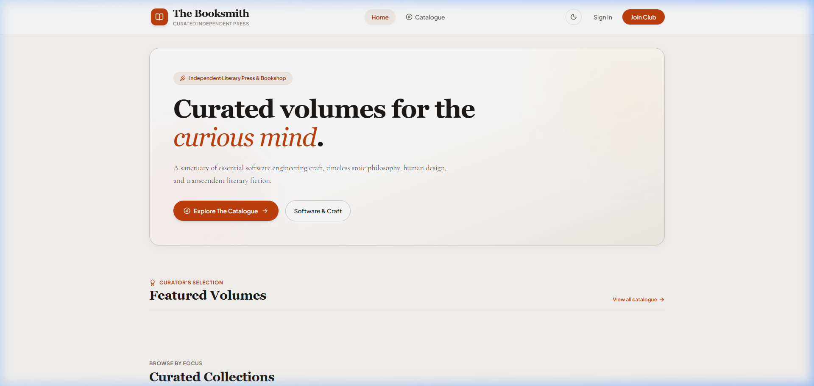
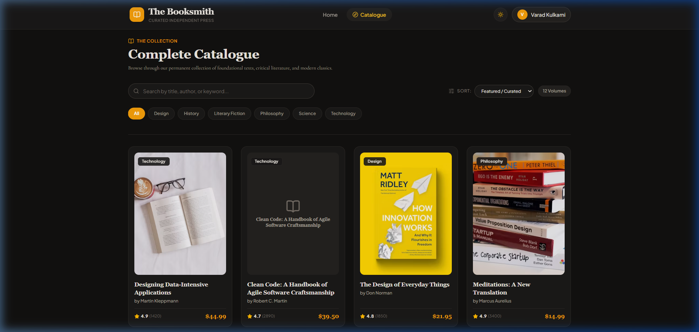

# The Booksmith — Modern Online Book Store

An enterprise-grade, responsive online bookstore web application crafted with a **React 19 + TypeScript** frontend, a **Spring Boot 3 (Java 17)** REST API backend, and **MongoDB** document persistence.

Built for **Web Technology (WT) — Assignment 6** by **Varad**.

---

## 1. Overview & Key Capabilities

The application delivers an independent literary press & bookstore aesthetic (warm paper in light mode, deep inkwell charcoal in dark mode, editorial serif headings, and clean sans-serif UI typography).



### Core Features
- **Editorial Home Showcase**: Hero banner with curated typography, curator's featured volumes, and thematic collection shelves.
- **Dynamic Catalogue**: Real-time keyword search (title, author, synopsis), genre filtering pills, multi-criteria sorting (Price, Rating, Publication Year, Title, Featured), and responsive book grid with skeleton loading.
- **Book Details & Synopsis**: Slide-over details view presenting high-resolution cover artwork, verified reader ratings, hardcover pricing, ISBN/publisher metadata, and reading list actions.


- **Secure Authentication & Session Management**:
  - **User Registration**: Form validation on frontend & backend, email duplication detection, and **BCrypt (12 rounds)** password hashing.
  - **User Login**: Stateless JWT token authentication with user avatar state in navigation.
  - **MongoDB Persistence**: Users and rich curated book collections are stored in MongoDB with unique indexing.
- **Persistent Dual Themes**: Theme toggle supporting paper-inspired Light Mode and inkwell Dark Mode with `localStorage` persistence.
- **Responsive Layout**: Designed for mobile, tablet, and desktop viewports.

---

## 2. Technology Stack

| Layer | Technology | Version | Purpose |
| :--- | :--- | :--- | :--- |
| **Frontend UI** | **React** + **TypeScript** | `19.0.0` / `5.7` | Type-safe modular user interface & state. |
| **Build & Tooling** | **Vite** | `6.1.0` | Ultra-fast HMR and production bundling. |
| **Styling** | **Tailwind CSS v4** + CSS Tokens | `4.0.0` | Custom CSS variables for paper & ink themes. |
| **Icons** | **Lucide React** | `1.16.0` | Consistent iconography. |
| **Backend API** | **Spring Boot** (Java 17) | `3.3.3` | Layered REST API (Controller, Service, Repository). |
| **Security & Auth** | **Spring Security** + **JJWT** | `0.12.6` | Stateless JWT tokens & BCrypt password encryption. |
| **Database** | **MongoDB** | `7.0` | NoSQL document storage with auto-seeding. |
| **Containerization** | **Docker** & **Docker Compose** | Multi-stage | Full-stack orchestration (Frontend + Backend + Mongo). |
| **CI/CD** | **GitHub Actions** | v4 | Automated TypeScript check, Java build, and Docker smoke tests. |

---

## 3. Architecture & Project Layout

```text
Assignment6/
├── backend/
│   ├── src/
│   │   ├── main/
│   │   │   ├── java/com/bookstore/
│   │   │   │   ├── config/              # SecurityConfig, JwtUtils, JwtAuthFilter
│   │   │   │   ├── controller/          # AuthController, BookController, HealthController
│   │   │   │   ├── dto/                 # RegisterRequest, LoginRequest, AuthResponse, etc.
│   │   │   │   ├── exception/           # GlobalExceptionHandler, Custom Exceptions
│   │   │   │   ├── model/               # User, Book, Role entities
│   │   │   │   ├── repository/          # UserRepository, BookRepository
│   │   │   │   ├── service/             # AuthService, BookService, DataInitializerService
│   │   │   │   └── OnlineBookStoreApplication.java
│   │   │   └── resources/
│   │   │       └── application.yml      # Spring & MongoDB configuration
│   │   └── test/                        # Unit and integration test suites
│   ├── Dockerfile                       # Multi-stage Maven + JRE container
│   └── pom.xml
├── frontend/
│   ├── src/
│   │   ├── components/
│   │   │   ├── books/                   # BookCard, BookGrid, BookDetailModal, CatalogueFilter
│   │   │   └── layout/                  # Navbar, Footer
│   │   ├── context/                     # ThemeContext, AuthContext
│   │   ├── pages/                       # HomePage, CataloguePage, LoginPage, RegisterPage
│   │   ├── services/                    # api.ts, authService.ts, bookService.ts
│   │   ├── styles/                      # index.css (Theme tokens & typography)
│   │   ├── types/                       # TypeScript interfaces (Book, User, Auth, Api)
│   │   ├── App.tsx
│   │   └── main.tsx
│   ├── Dockerfile                       # Multi-stage Node + Nginx container
│   ├── nginx.conf                       # Production Nginx SPA & API reverse proxy
│   ├── package.json
│   └── vite.config.ts
├── .github/workflows/
│   └── ci.yml                           # Automated GitHub Actions workflow
├── docker-compose.yml                   # 3-tier local stack orchestration
├── .gitignore
└── README.md
```

---

## 4. REST API Reference

### Authentication Endpoints (`/api/auth`)
- `POST /api/auth/register` — Register a new reader account (validates name, email, password; hashes password with BCrypt).
- `POST /api/auth/login` — Authenticate credentials and returns a Bearer JWT token + user profile.
- `GET /api/auth/me` — Retrieve the currently authenticated user's profile (Requires `Authorization: Bearer <token>`).

### Books Catalogue Endpoints (`/api/books`)
- `GET /api/books` — Retrieve all books (supports query parameters: `?search=clean&category=Technology&sort=price-asc`).
- `GET /api/books/featured` — Retrieve curator's featured staff picks.
- `GET /api/books/{id}` — Retrieve detailed metadata and synopsis for a specific book volume.
- `GET /api/books/categories` — Retrieve all available genre categories.

### System & Health Probes (`/api/health`)
- `GET /api/health` — Returns status (`UP`), service name, and version.

---

## 5. Getting Started

### Prerequisites
- **Node.js** `v20.x` or `v22.x` & `npm`
- **Java 17 (JDK)** (Amazon Corretto, Eclipse Temurin, or OpenJDK)
- **MongoDB** (local instance on port `27017` or Docker)

---

### Running the Frontend Locally

```bash
cd Assignment6/frontend
npm install
npm run dev
```
The React development application will start on `http://localhost:5173`.

To verify the production build:
```bash
npm run build
```

---

### Running the Backend Locally

Ensure MongoDB is running locally on `mongodb://localhost:27017/online_bookstore`.

```bash
cd Assignment6/backend
mvn spring-boot:run
```
The Spring Boot backend will start on `http://localhost:8080` and automatically seed the book catalogue if the database collection is empty.

---

### Running the Complete Stack with Docker Compose

To build and run all 3 services (MongoDB 7.0 + Spring Boot API + Nginx React Frontend):

```bash
cd Assignment6
docker compose up -d --build
```

Access points:
- **Web Application**: `http://localhost` or `http://localhost:3000`
- **Backend API**: `http://localhost:8080/api/health`
- **MongoDB**: `localhost:27017`

To shut down:
```bash
docker compose down
```

---

## 6. Continuous Integration (CI/CD)

A GitHub Actions workflow is located at `.github/workflows/assignment-6-ci.yml`. It runs automatically on pushes and pull requests affecting `Assignment6/` and performs:
1. **Frontend Job**: Installs dependencies and runs `npm run build` (TypeScript compilation).
2. **Backend Job**: Sets up Java 17, executes unit tests (`mvn test`), and packages the Spring Boot JAR.
3. **Docker Smoke Test**: Validates that both multi-stage Docker images build without errors.

---

## 7. Author

- **Author**: Varad
- **Course**: SEM V — Web Technology (WT)
- **Assignment**: Assignment 6 (Online Book Store)
